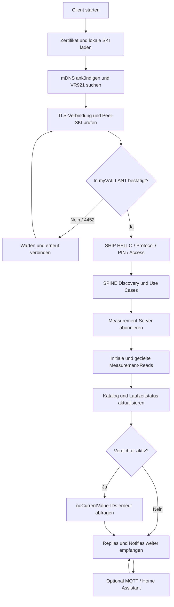

# Vaillant VR921 – SHIP/SPINE Python Client

Eigenständiger, monolithischer Python-Client für den lesenden Zugriff auf Vaillant-VR921-Gateways über EEBUS SHIP/SPINE. Das Projekt ist keine HEMS-Integration und enthält keinen zweiten Dienst oder Adapter.

## Eingefrorener Funktionsstand

`connect_vr921.py` entspricht dem als funktionierend bestätigten Stand `vaillant1_active_reprobe.py`.

```text
SHA-256: c827363a36ef5c52c61fcd61ea257d1aceab3c0025ddb61121c8b9050ed3e4b9
Zeilen:  2301
Bytes:   114906
```

Dieser Stand ist die Referenz für:

- Zertifikat und lokale EEBUS-Identität
- mDNS-Ankündigung und VR921-Erkennung
- TLS-Peerprüfung und dauerhaftes Peer-Pinning
- myVAILLANT-Trust und SHIP-Handshake
- Reconnect-Verhalten
- SPINE Discovery, Subscriptions und gezielte Measurement-Reads
- Measurement-Katalog und Laufzeitverfügbarkeit
- Compressor Active-Reprobe
- MQTT und Home Assistant Discovery

Änderungen an `connect_vr921.py` erfordern eine ausdrückliche Freigabe und eine Aktualisierung des dokumentierten Hashes. Die README darf weiter präzisiert werden, ohne den eingefrorenen Python-Stand zu verändern.

## Funktionsumfang

Der Client arbeitet ausschließlich lesend beziehungsweise beobachtend. Er schreibt keine Heizungs-Sollwerte und übernimmt keine Anlagensteuerung.

Er kann:

- ein persistentes EC-Client-Zertifikat erzeugen und wiederverwenden;
- sich als `_ship._tcp.local.` per mDNS ankündigen;
- lokale, eigene und ungültige SHIP-Ankündigungen ignorieren;
- einen VR921 anhand eines mDNS-Namens erkennen, der mit `vr921` beginnt;
- die TLS-Zertifikats-SKI gegen die mDNS-SKI prüfen;
- den erfolgreich bestätigten VR921-Peer dauerhaft pinnen;
- während des myVAILLANT-Trust-Vorgangs in der SHIP-HELLO-Phase warten;
- nach Trust-Ablehnung, Sitzungsende oder Netzwerkfehlern erneut verbinden;
- die entfernte SPINE-Struktur und Measurement-Server entdecken;
- Measurement-Server abonnieren und initial vollständig lesen;
- jede angekündigte Measurement-ID zusätzlich gezielt abfragen;
- alle numerischen Measurement-Werte übernehmen, ohne unbelegte L1/L2/L3-Zuordnung;
- angekündigte und aktuell verfügbare Messwerte getrennt dokumentieren;
- zunächst wertlose Verdichtermessungen bei aktivem Verdichter erneut abfragen;
- Messwerte optional per MQTT und Home Assistant Discovery veröffentlichen.

## Ablauf



## Voraussetzungen

- Linux-System im selben IPv4-Netz wie der VR921
- funktionierendes mDNS/Multicast-DNS
- Python 3.9 oder neuer
- Schreibzugriff auf `/home/markus/EEBUS`
- myVAILLANT-App für die erstmalige EEBUS-Freigabe

Die Syntax des eingefrorenen Standes ist mit Python 3.9 kompatibel. Die Abhängigkeiten stehen in `requirements.txt`.

## Installation

```bash
cd /home/markus/EEBUS
python3 -m venv .venv
source .venv/bin/activate
pip install -r requirements.txt
```

Start:

```bash
python3 connect_vr921.py
```

## Persistente Dateien und Identitäten

Der Pfad ist im eingefrorenen Stand fest als `CERT_DIR = "/home/markus/EEBUS"` definiert.

| Datei | Bedeutung |
|---|---|
| `/home/markus/EEBUS/cert.pem` | Öffentliches Client-Zertifikat und Quelle der lokalen SKI |
| `/home/markus/EEBUS/key.pem` | Privater EC-Schlüssel; wird mit Modus `0600` angelegt |
| `/home/markus/EEBUS/vr921_peer.json` | Gepinnte VR921-SKI und SHA-256-Zertifikatsfingerprint |
| `/home/markus/EEBUS/vr921_measurement_descriptions.json` | Vollständiger Measurement-Katalog und Laufzeitverfügbarkeit |

`cert.pem` und `key.pem` bilden gemeinsam die in myVAILLANT bestätigte Client-Identität. Werden sie ersetzt oder aus einem anderen Verzeichnis verwendet, erscheint der Client als neues EEBUS-Gerät und muss erneut freigegeben werden.

Private Schlüssel und Peer-Pin dürfen nicht veröffentlicht werden.

## Erstes Pairing in myVAILLANT

1. Client starten.
2. Auf `VR921 found` und anschließend `WAITING_FOR_TRUST` beziehungsweise `HELLO ... PENDING` achten.
3. In myVAILLANT zu den Netzwerkeinstellungen und EEBUS wechseln.
4. Den Client anhand der im Log ausgegebenen lokalen SKI beziehungsweise SHIP-ID bestätigen.
5. Den Prozess weiterlaufen lassen. Bei Close-Code `4452` wartet er standardmäßig zehn Sekunden und versucht es erneut.
6. Nach erfolgreichem SHIP-Handshake wird der verifizierte VR921-Peer in `vr921_peer.json` gespeichert.

Der TLS-Peer wird bereits vor Abschluss des Pairings gegen die per mDNS angekündigte SKI geprüft. Bei einem späteren Wechsel der Peer-SKI beendet der Client die Verbindung fail-closed und überschreibt den gespeicherten Pin nicht.

## Discovery und mehrere VR921

Der eingefrorene Stand filtert mDNS-Kandidaten wie folgt:

- keine Dienste auf der eigenen IPv4-Adresse;
- keine Dienste mit der eigenen Client-SKI;
- keine Dienste ohne gültige 40-stellige Hex-SKI;
- nur Dienstnamen, die mit `vr921` beginnen.

Aktuelle Einschränkung: `MDNSHandler` speichert den ersten passenden VR921 in `target_info`. Außerdem enthält `vr921_peer.json` genau eine gepinnte Peer-Identität. Der eingefrorene Stand bietet daher noch keine interaktive Auswahl zwischen zwei VR921 und ist für genau einen ausgewählten Peer pro Identitätsverzeichnis ausgelegt.

Eine Mehrgeräteauswahl muss als getrennte, ausdrücklich freigegebene Erweiterung auf dieser Referenzbasis erfolgen. Sie darf den eingefrorenen Pairing- und SHIP-Ablauf nicht verändern.

## TLS-, Trust- und Reconnect-Verhalten

- TLS ab Version 1.2 mit Client-Zertifikat
- WebSocket-Subprotokoll `ship`
- WebSocket-Ping deaktiviert, da SHIP die Sitzung verwaltet
- SHIP-Handshake-Timeout: 120 Sekunden
- Trust-Retry bei Close-Code `4452`: standardmäßig 10 Sekunden
- Reconnect bei Close-Code `4500`: standardmäßig 10 Sekunden
- mDNS-Suchdauer: 30 Sekunden; danach erneute Suche nach 60 Sekunden
- sonstige Verbindungsfehler: erneuter Versuch nach 60 Sekunden

Ein geänderter vollständiger Zertifikatsfingerprint wird toleriert, wenn die kryptografische SKI gleich geblieben ist. Der Client protokolliert diesen Fall als Warnung.

## SPINE- und Measurement-Verarbeitung

Nach erfolgreichem SHIP-Handshake:

1. wird die entfernte Geräteadresse aus dem ersten SPINE-Datagramm gelernt;
2. werden Detailed Discovery und Node Management Use Case Data angefordert;
3. werden bevorzugt Measurement-Server auf Entity `[1]` gewählt; andernfalls erfolgt ein Fallback auf alle erkannten Measurement-Server;
4. werden Subscriptions eingerichtet;
5. werden Measurement-Beschreibungen und aktuelle Werte initial gelesen;
6. wird jede beschriebene Measurement-ID einzeln abgefragt;
7. werden weitere `reply`- und `notify`-Nachrichten fortlaufend verarbeitet.

Der Parser akzeptiert jeden numerischen Wert, den der VR921 tatsächlich liefert. Wiederholte AC-Messungen erhalten ohne belastbare Protokollinformation keine erfundene Phasenzuordnung.

### Measurement-Katalog

Standardpfad:

```text
/home/markus/EEBUS/vr921_measurement_descriptions.json
```

Der Katalog enthält unter anderem:

- lokale und entfernte SKI;
- Remote Device Address;
- Entity, Feature und Entity-Beschreibung je Measurement-Server;
- vollständige, unveränderte Measurement-Description-Objekte;
- alle angekündigten Measurement-IDs;
- `runtimeAvailability` je ID;
- zuletzt beobachteten Wert, Einheit und Zeitstempel;
- zugehörige Request-/Reply-`msgCounter`;
- zusammengefasste Listen für `valueAvailable` und `noCurrentValue`.

Die zentralen Laufzeitzustände sind:

| Status | Bedeutung |
|---|---|
| `advertised` | ID wurde beschrieben, aber noch nicht gezielt geprüft |
| `valueAvailable` | Ein numerischer Wert wurde per Reply oder Notify beobachtet |
| `noCurrentValue` | Die gezielte Antwort enthielt für diese ID keinen numerischen Wert |

Ein vorhandener Katalog mit einer anderen Remote-SKI wird nicht als Katalog des aktuell verbundenen Geräts übernommen.

## Compressor Active-Reprobe

Einige vom VR921 angekündigte Verdichtermessungen liefern im Stillstand keinen aktuellen Wert. Der eingefrorene Stand verwendet deshalb die Gesamtleistung des Verdichters auf Entity `[3, 1]`, Feature `11` als Aktivitätssignal:

- Scope `acPowerTotal` oder Measurement-ID `9`
- Aktiv ab standardmäßig `100 W`
- Rückkehr in Standby bei standardmäßig `50 W`
- Reprobe-Intervall standardmäßig `60 s`

Sobald der Verdichter aktiv wird, fragt der Client die auf demselben Measurement-Server als `noCurrentValue` markierten IDs erneut einzeln ab. ID `9` selbst wird nicht re-probt. Solange der Verdichter aktiv bleibt, kann die Prüfung im konfigurierten Intervall wiederholt werden. Bereits ausstehende IDs werden nicht doppelt angefordert.

Das ist ausschließlich ein zusätzlicher Lesevorgang; es wird kein Verdichterzustand geschrieben oder gesteuert.

## MQTT und Home Assistant

MQTT ist deaktiviert, solange weder `HA_MQTT_HOST` noch ein Host in `mqtt_secrets.py` gesetzt ist.

Bei aktivem MQTT:

- wird ein Availability-Topic mit `online`/`offline` verwendet;
- werden Home-Assistant-Discovery-Konfigurationen retained veröffentlicht;
- enthält jede Sensor-ID Scope, Entity, Feature und Measurement-ID;
- werden numerische Werte aus Replies und Notifies veröffentlicht;
- sind State-Nachrichten standardmäßig nicht retained.

Die Zugangsdaten können in `mqtt_secrets.py` oder per Environment gesetzt werden. Environment-Variablen haben Vorrang.

## Konfiguration

Nur die folgenden Variablen werden im eingefrorenen Stand ausgewertet:

| Variable | Default | Bedeutung |
|---|---:|---|
| `HA_MQTT_HOST` | leer | MQTT-Broker; leer deaktiviert MQTT |
| `HA_MQTT_PORT` | `1883` | MQTT-Port |
| `HA_MQTT_USER` | leer | MQTT-Benutzer |
| `HA_MQTT_PASSWORD` | leer | MQTT-Passwort |
| `HA_MQTT_PREFIX` | `homeassistant` | Home-Assistant-Discovery-Präfix |
| `HA_MQTT_STATE_PREFIX` | `ship` | Präfix für State und Availability |
| `HA_DEVICE_ID` | aus lokaler SHIP-ID | Home-Assistant-Geräte-ID |
| `HA_DEVICE_NAME` | `EEBUS HeatPump` | Angezeigter Gerätename |
| `SHIP_MQTT_RETAIN_STATE` | `false` | MQTT-State retained veröffentlichen |
| `SHIP_MEASUREMENT_CATALOG_FILE` | `/home/markus/EEBUS/vr921_measurement_descriptions.json` | Alternativer Katalogpfad |
| `SHIP_LOG_MEASUREMENT_DESCRIPTIONS` | `true` | Vollständige Measurement-Descriptions protokollieren |
| `SHIP_TRUST_RETRY_SECONDS` | `10` | Retry nach Trust-Ablehnung; Minimum 5 s |
| `SHIP_RECONNECT_SECONDS` | `10` | Retry nach Handshake-/Session-Ende; Minimum 5 s |
| `SHIP_COMPRESSOR_ACTIVE_ON_W` | `100` | Einschaltgrenze der Active-Reprobe; Minimum 1 W |
| `SHIP_COMPRESSOR_ACTIVE_OFF_W` | `50` | Ausschaltgrenze; Minimum 0 W und kleiner als ON |
| `SHIP_COMPRESSOR_REPROBE_SECONDS` | `60` | Wiederholintervall bei aktivem Verdichter; Minimum 10 s |

Die in älteren README-Ständen genannten Variablen `SHIP_JSONL`, `SHIP_DISCOVERY_LOG` und `SHIP_MQTT_DEBUG` werden von diesem Python-Stand nicht ausgewertet.

Beispiel für `/etc/default/vaillant-vr921`:

```bash
HA_MQTT_HOST=
HA_MQTT_PORT=1883
HA_MQTT_USER=
HA_MQTT_PASSWORD=
HA_MQTT_PREFIX=homeassistant
HA_MQTT_STATE_PREFIX=ship
HA_DEVICE_NAME=EEBUS HeatPump
SHIP_MQTT_RETAIN_STATE=false

SHIP_LOG_MEASUREMENT_DESCRIPTIONS=true
SHIP_MEASUREMENT_CATALOG_FILE=/home/markus/EEBUS/vr921_measurement_descriptions.json

SHIP_TRUST_RETRY_SECONDS=10
SHIP_RECONNECT_SECONDS=10

SHIP_COMPRESSOR_ACTIVE_ON_W=100
SHIP_COMPRESSOR_ACTIVE_OFF_W=50
SHIP_COMPRESSOR_REPROBE_SECONDS=60
```

## Betrieb mit systemd

Da `CERT_DIR` fest auf `/home/markus/EEBUS` zeigt, muss der Service-Benutzer dort lesen und schreiben können.

```ini
[Unit]
Description=Vaillant VR921 SHIP/SPINE client
Wants=network-online.target
After=network-online.target

[Service]
Type=simple
User=markus
WorkingDirectory=/home/markus/EEBUS
EnvironmentFile=-/etc/default/vaillant-vr921
ExecStart=/home/markus/EEBUS/.venv/bin/python /home/markus/EEBUS/connect_vr921.py
Restart=on-failure
RestartSec=5

[Install]
WantedBy=multi-user.target
```

Aktivieren und Logs verfolgen:

```bash
sudo systemctl daemon-reload
sudo systemctl enable --now vaillant-vr921.service
journalctl -u vaillant-vr921.service -f
```

## Diagnose

| Meldung | Bedeutung |
|---|---|
| `WAITING_FOR_TRUST` / Close-Code `4452` | Client wurde noch nicht in myVAILLANT bestätigt oder dort abgelehnt |
| `VR921 peer identity verification failed` | TLS-SKI stimmt nicht mit mDNS oder gespeichertem Peer-Pin überein |
| `No VR921 found` | Kein gültiger, nicht-lokaler mDNS-Dienst mit Namen `vr921...` gefunden |
| `noCurrentValue` | ID ist beschrieben, liefert in diesem Betriebszustand aber keinen numerischen Wert |
| `Compressor became active` | Active-Reprobe wurde durch die Verdichter-Gesamtleistung aktiviert |
| Close-Code `4500` | VR921 hat die Sitzung geschlossen; der Client verbindet erneut |

## Baseline prüfen

```bash
shasum -a 256 connect_vr921.py
python3 -m unittest discover -s tests -v
```

Der erwartete Hash ist `c827363a36ef5c52c61fcd61ea257d1aceab3c0025ddb61121c8b9050ed3e4b9`.

---

## English summary

This repository contains a standalone, monolithic, read-only SHIP/SPINE client for Vaillant VR921 gateways. `connect_vr921.py` is frozen at SHA-256 `c827363a36ef5c52c61fcd61ea257d1aceab3c0025ddb61121c8b9050ed3e4b9`.

The frozen client provides persistent certificate identity, mDNS discovery, TLS SKI verification, fail-closed peer pinning, myVAILLANT trust retries, SHIP/SPINE discovery, subscriptions, targeted reads for every advertised measurement ID, persistent runtime availability, compressor-active re-probing, and optional MQTT/Home Assistant Discovery.

Important limitations:

- It is read-only and doesn't control the heating system.
- `CERT_DIR` is fixed to `/home/markus/EEBUS`.
- It stores one pinned VR921 peer and selects the first valid `vr921...` mDNS candidate.
- It doesn't yet provide interactive selection between multiple VR921 devices.
- Changes to the frozen Python file require explicit approval and a baseline-hash update.

See the German sections above for the complete configuration table, pairing procedure, measurement catalog, Active-Reprobe behavior, and systemd example.
