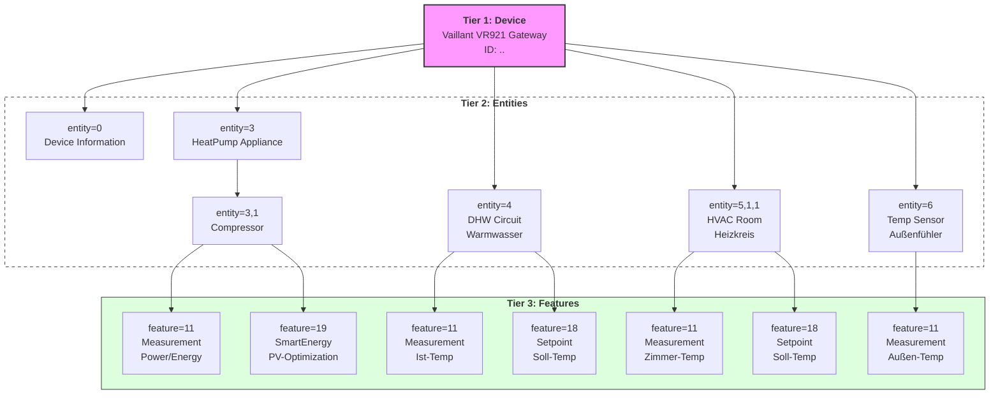

# Vaillant VR921 – SHIP/SPINE Python Client (DE/EN)

## Deutsch

### Zweck
Dieses Projekt enthält ein diagnostisches Python-Skript ([connect_vr921.py](connect_vr921.py)), das mit einem Vaillant VR921/EEBUS-Gateway über **SHIP** (TLS WebSocket) spricht und darüber **SPINE**-Datagramme austauscht.

Das Skript kann:
- ein **Client-Zertifikat** erzeugen und wiederverwenden (stabile Identität über SKI)
- sich per **mDNS** (`_ship._tcp.local.`) selbst ankündigen und den VR921 finden
- eine **wss://…/ship/** Verbindung aufbauen und den **SHIP-Handshake** durchführen
- auf gateway-initiierte **SPINE READ/CALL** Nachrichten reagieren (wichtig für Interoperabilität)
- die vollständige Feature-Discovery auswerten und nur ausdrücklich angekündigte **READ**-Funktionen abfragen
- **Measurement**, **Setpoint**, **HVAC**, **SmartEnergyManagementPs**, **DeviceDiagnosis** und **ElectricalConnection** lesen
- optional Messwerte per **MQTT** inkl. **Home Assistant Discovery** veröffentlichen

### Wichtige Begriffe
- **SHIP**: Transport-/Session-Protokoll über TLS WebSocket.
- **SPINE**: Datenmodell/Anwendungsprotokoll, das in SHIP DATA Frames transportiert wird.
- **SKI**: *Subject Key Identifier* (Hex) aus dem X.509-Zertifikat – dient als stabile Client-Identität.
- **EEBUS JSON / array-wrapped JSON**: Manche Implementierungen kodieren JSON als Liste von Single-Key-Objekten.

---

## English

### Purpose
This project contains a diagnostic Python script ([connect_vr921.py](connect_vr921.py)) that talks to a Vaillant VR921/EEBUS gateway via **SHIP** (TLS WebSocket) and exchanges **SPINE** datagrams.

The script can:
- generate and reuse a **client certificate** (stable identity via SKI)
- announce itself and discover the VR921 via **mDNS** (`_ship._tcp.local.`)
- connect to **wss://…/ship/** and run the **SHIP handshake**
- respond to gateway-initiated **SPINE READ/CALL** messages (required for interoperability)
- evaluate complete feature discovery and query only explicitly advertised **READ** functions
- read **Measurement**, **Setpoint**, **HVAC**, **SmartEnergyManagementPs**, **DeviceDiagnosis** and **ElectricalConnection** data
- optionally publish telemetry via **MQTT** with **Home Assistant Discovery**

### Key Terms
- **SHIP**: transport/session protocol over TLS WebSocket.
- **SPINE**: application data model/protocol transported inside SHIP DATA frames.
- **SKI**: X.509 *Subject Key Identifier* (hex) used as a stable client identity.
- **EEBUS JSON / array-wrapped JSON**: some stacks encode JSON as list-of-single-key objects.

---

# Setup

## Deutsch

### Voraussetzungen
- Python 3.9+ (wird in CI getestet)
- Netzwerkzugriff auf den VR921 im selben Netzwerk (mDNS muss funktionieren)

### Installation
```bash
python3 -m venv .venv
source .venv/bin/activate
pip install -r requirements.txt
```

### Optional: MQTT/ Home Assistant
- Wenn du MQTT nutzen willst: `paho-mqtt` ist bereits in [requirements.txt](requirements.txt) enthalten.
- Kopiere [mqtt_secrets.example.py](mqtt_secrets.example.py) nach `mqtt_secrets.py` und trage dort optional die Broker-Zugangsdaten ein. Die lokale Datei wird von Git ignoriert.

### Betrieb auf Raspberry Pi / Server (als Daemon)
Du kannst das Skript dauerhaft auf einem Raspberry Pi (Raspberry Pi OS) oder einem Linux-Server im Netzwerk laufen lassen – typisch über **systemd**.

1) Projekt z.B. nach `/opt/Vaillant-VR921` kopieren und dort die venv anlegen:
```bash
sudo mkdir -p /opt/Vaillant-VR921
sudo chown -R $USER: /opt/Vaillant-VR921

cd /opt/Vaillant-VR921
python3 -m venv .venv
source .venv/bin/activate
pip install -r requirements.txt
```

2) Optional: Umgebungsvariablen in eine Environment-Datei legen (empfohlen):
`/etc/default/vaillant-vr921`
```bash
# MQTT (optional)
HA_MQTT_HOST=
HA_MQTT_PORT=1883
HA_MQTT_USER=
HA_MQTT_PASSWORD=

# Logging (optional)
SHIP_JSONL=true
SHIP_DISCOVERY_LOG=false

# In myVAILLANT sichtbare SHIP-Identität (optional)
SHIP_MDNS_SERVICE_NAME=VR921-EEBUS-Client
SHIP_DEVICE_BRAND=OpenSource
SHIP_DEVICE_MODEL=VR921-EEBUS-Client
SHIP_DEVICE_TYPE=Energy-Management-System

# Optional: bekannten VR921 vor dem ersten Verbindungsaufbau festlegen
VR921_REMOTE_SKI=
```

3) systemd Service anlegen: `/etc/systemd/system/vaillant-vr921.service`
```ini
[Unit]
Description=Vaillant VR921 SHIP/SPINE client
Wants=network-online.target
After=network-online.target

[Service]
Type=simple
User=pi
WorkingDirectory=/opt/Vaillant-VR921
EnvironmentFile=-/etc/default/vaillant-vr921
ExecStart=/opt/Vaillant-VR921/.venv/bin/python /opt/Vaillant-VR921/connect_vr921.py
Restart=on-failure
RestartSec=5

[Install]
WantedBy=multi-user.target
```

4) Service aktivieren und starten:
```bash
sudo systemctl daemon-reload
sudo systemctl enable --now vaillant-vr921.service
sudo systemctl status vaillant-vr921.service
```

Logs ansehen:
```bash
journalctl -u vaillant-vr921.service -f
```

## English

### Prerequisites
- Python 3.9+ (covered by CI)
- Network access to the VR921 on the same LAN (mDNS must work)

### Installation
```bash
python3 -m venv .venv
source .venv/bin/activate
pip install -r requirements.txt
```

### Optional: MQTT / Home Assistant
- If you want MQTT: `paho-mqtt` is included in [requirements.txt](requirements.txt).
- Copy [mqtt_secrets.example.py](mqtt_secrets.example.py) to `mqtt_secrets.py` and optionally enter the broker credentials there. The local file is ignored by Git.

### Running on a Raspberry Pi / server (as a daemon)
You can run the script continuously on a Raspberry Pi (Raspberry Pi OS) or a Linux server in your LAN – typically via **systemd**.

1) Copy the project e.g. to `/opt/Vaillant-VR921` and create a venv there:
```bash
sudo mkdir -p /opt/Vaillant-VR921
sudo chown -R $USER: /opt/Vaillant-VR921

cd /opt/Vaillant-VR921
python3 -m venv .venv
source .venv/bin/activate
pip install -r requirements.txt
```

2) Optional: put environment variables into an env file (recommended):
`/etc/default/vaillant-vr921`
```bash
# MQTT (optional)
HA_MQTT_HOST=
HA_MQTT_PORT=1883
HA_MQTT_USER=
HA_MQTT_PASSWORD=

# Logging (optional)
SHIP_JSONL=true
SHIP_DISCOVERY_LOG=false

# SHIP identity visible in myVAILLANT (optional)
SHIP_MDNS_SERVICE_NAME=VR921-EEBUS-Client
SHIP_DEVICE_BRAND=OpenSource
SHIP_DEVICE_MODEL=VR921-EEBUS-Client
SHIP_DEVICE_TYPE=Energy-Management-System

# Optional: pin the known VR921 before the first connection
VR921_REMOTE_SKI=
```

3) Create a systemd unit: `/etc/systemd/system/vaillant-vr921.service`
```ini
[Unit]
Description=Vaillant VR921 SHIP/SPINE client
Wants=network-online.target
After=network-online.target

[Service]
Type=simple
User=pi
WorkingDirectory=/opt/Vaillant-VR921
EnvironmentFile=-/etc/default/vaillant-vr921
ExecStart=/opt/Vaillant-VR921/.venv/bin/python /opt/Vaillant-VR921/connect_vr921.py
Restart=on-failure
RestartSec=5

[Install]
WantedBy=multi-user.target
```

4) Enable + start the service:
```bash
sudo systemctl daemon-reload
sudo systemctl enable --now vaillant-vr921.service
sudo systemctl status vaillant-vr921.service
```

View logs:
```bash
journalctl -u vaillant-vr921.service -f
```

---

# Configuration

## Deutsch

### MQTT/HA (optional)
Du kannst MQTT auf zwei Arten konfigurieren:
1) `mqtt_secrets.example.py` nach `mqtt_secrets.py` kopieren und die lokale Datei ausfüllen
2) oder Umgebungsvariablen setzen (überschreiben `mqtt_secrets.py`)

Relevante Variablen:
- `HA_MQTT_HOST`, `HA_MQTT_PORT`, `HA_MQTT_USER`, `HA_MQTT_PASSWORD`
- `HA_MQTT_PREFIX` (Default `homeassistant`)
- `HA_MQTT_STATE_PREFIX` (Default `ship`)
- `SHIP_MQTT_DEBUG` (True/False)
- `SHIP_MQTT_RETAIN_STATE` (True/False)
- `HA_MQTT_TLS`, `HA_MQTT_CA_CERTS`, `HA_MQTT_TLS_INSECURE`

Zusätzlich:
- `HA_DEVICE_ID` / `HA_DEVICE_NAME` zur Identifikation in Home Assistant

### Logging/Output
- `SHIP_JSONL=true` reserviert stdout für gültiges JSONL. Menschliche Diagnoseausgaben gehen nach stderr.
- `SHIP_DISCOVERY_LOG=true` gibt zusätzliche Discovery-Infos aus.
- `SHIP_HANDSHAKE_LOG=false` blendet standardmäßig rohe Handshake-Payloads aus; `true` ist nur für gezielte Diagnose gedacht.

### SHIP/SPINE Sicherheit und READ-Profil
- `SHIP_MDNS_SERVICE_NAME`, `SHIP_DEVICE_BRAND`, `SHIP_DEVICE_MODEL` und `SHIP_DEVICE_TYPE`: bestimmen die in myVAILLANT sichtbare lokale SHIP-Identität. Leerraum und Semikolons sind in SHIP-TXT-Werten nicht zulässig.
- `SHIP_DEVICE_SERIAL`, `SHIP_DEVICE_CATEGORIES` (Default `2`, Energiemanagement) und `SHIP_ID`: optionale weitere SHIP-Identitätswerte. Ohne Konfiguration bleiben ID und Serienkennung an das persistente Client-Zertifikat gebunden.
- `VR921_REMOTE_SKI`: optional erwartete Remote-SKI. Nach dem ersten erfolgreich in der App bestätigten Handshake wird die Identität zusätzlich in `vr921_peer.json` gepinnt.
- `VR921_PEER_FILE`: alternativer Pfad für den persistenten Peer-Pin.
- `SHIP_READ_ALL_ADVERTISED=false`: standardmäßig werden nur bekannte, explizit als READ angekündigte Funktionen gelesen. `true` erlaubt alle angekündigten READ-Funktionen und ist nur für Diagnosezwecke gedacht.
- `SHIP_SUBSCRIBE_UPDATES=true`: abonniert unterstützte Server-Features und führt anschließend den Initial-Read aus.
- `SHIP_READ_DELAY_MS` (Default `30`): kleine Pause zwischen Discovery-basierten READs zum Schutz des Gateways.
- `SHIP_REQUEST_TIMEOUT`, `SHIP_HANDSHAKE_TIMEOUT`, `SHIP_RECONNECT_INITIAL_SECONDS`, `SHIP_RECONNECT_MAX_SECONDS`: Timeout- und Reconnect-Grenzen.
- `SHIP_PAIRING_ANNOUNCEMENT_SECONDS` (Default `30`): Zeit, in der die neue Client-Identität vor dem ersten Verbindungsversuch nur per mDNS sichtbar bleibt.
- `SHIP_PAIRING_RETRY_SECONDS` (Default `15`, Minimum `5`): langsames Wiederholungsintervall, solange VR921/myVAILLANT die noch nicht freigegebene Verbindung mit Code `4452` beendet. Die mDNS-Ankündigung bleibt dabei aktiv.
- `SHIP_REQUIRE_SUBPROTOCOL=true`: verlangt die WebSocket-Subprotokollbestätigung `ship`.
- `SHIP_OPEN_TIMEOUT`, `SHIP_MAX_FRAME_BYTES`, `SHIP_PING_INTERVAL` und `SHIP_PING_TIMEOUT`: begrenzen Verbindungsaufbau/Frame-Größe und konfigurieren die WebSocket-Lebenszeichen.
- `SHIP_OPENSSL_SECURITY_LEVEL_1=false`: nur für ältere VR921-Firmware aktivieren, falls deren Cipher mit dem OpenSSL-Standardprofil nicht funktioniert.

Das Programm führt keine SPINE-Writes auf Gerätefunktionen aus. WRITE-Fähigkeiten des Peers erteilen keine Schreibberechtigung.

Wenn sich das echte VR921-Zertifikat nach einem Firmware-/Gerätetausch ändert, beendet der Client die Verbindung absichtlich. `vr921_peer.json` darf erst nach manueller Prüfung der neuen SKI entfernt werden; beim nächsten in der myVAILLANT-App bestätigten Handshake wird neu gepinnt.

## English

### MQTT/HA (optional)
You can configure MQTT in two ways:
1) Copy `mqtt_secrets.example.py` to `mqtt_secrets.py` and fill in the local file
2) or set environment variables (they override `mqtt_secrets.py`)

Relevant variables:
- `HA_MQTT_HOST`, `HA_MQTT_PORT`, `HA_MQTT_USER`, `HA_MQTT_PASSWORD`
- `HA_MQTT_PREFIX` (default `homeassistant`)
- `HA_MQTT_STATE_PREFIX` (default `ship`)
- `SHIP_MQTT_DEBUG` (True/False)
- `SHIP_MQTT_RETAIN_STATE` (True/False)
- `HA_MQTT_TLS`, `HA_MQTT_CA_CERTS`, `HA_MQTT_TLS_INSECURE`

Also:
- `HA_DEVICE_ID` / `HA_DEVICE_NAME` for Home Assistant device naming

### Logging/Output
- `SHIP_JSONL=true` reserves stdout for valid JSONL. Human diagnostics are written to stderr.
- `SHIP_DISCOVERY_LOG=true` prints extra discovery details.
- `SHIP_HANDSHAKE_LOG=false` hides raw handshake payloads by default; enable it only for focused diagnostics.

### SHIP/SPINE security and READ profile
- `SHIP_MDNS_SERVICE_NAME`, `SHIP_DEVICE_BRAND`, `SHIP_DEVICE_MODEL` and `SHIP_DEVICE_TYPE`: configure the local SHIP identity visible in myVAILLANT. SHIP TXT values must not contain whitespace or semicolons.
- `SHIP_DEVICE_SERIAL`, `SHIP_DEVICE_CATEGORIES` (default `2`, energy management) and `SHIP_ID`: optional additional identity values. Without configuration, the ID and serial stay tied to the persistent client certificate.
- `VR921_REMOTE_SKI`: optional expected remote SKI. After the first app-confirmed handshake the identity is also pinned in `vr921_peer.json`.
- `VR921_PEER_FILE`: alternate path for the persistent peer pin.
- `SHIP_READ_ALL_ADVERTISED=false`: by default only known functions explicitly advertised for READ are queried. `true` enables all advertised READ functions for diagnostics.
- `SHIP_SUBSCRIBE_UPDATES=true`: subscribes to supported server features, followed by an initial read.
- `SHIP_READ_DELAY_MS` (default `30`): small delay between discovery-driven reads to protect the gateway.
- `SHIP_REQUEST_TIMEOUT`, `SHIP_HANDSHAKE_TIMEOUT`, `SHIP_RECONNECT_INITIAL_SECONDS`, `SHIP_RECONNECT_MAX_SECONDS`: timeout and reconnect limits.
- `SHIP_PAIRING_ANNOUNCEMENT_SECONDS` (default `30`): time during which a new client identity remains visible through mDNS before its first connection attempt.
- `SHIP_PAIRING_RETRY_SECONDS` (default `15`, minimum `5`): slow retry interval while VR921/myVAILLANT closes a not-yet-approved connection with code `4452`. The mDNS announcement remains active.
- `SHIP_REQUIRE_SUBPROTOCOL=true`: requires the `ship` WebSocket subprotocol confirmation.
- `SHIP_OPEN_TIMEOUT`, `SHIP_MAX_FRAME_BYTES`, `SHIP_PING_INTERVAL` and `SHIP_PING_TIMEOUT`: limit connection setup/frame size and configure WebSocket liveness checks.
- `SHIP_OPENSSL_SECURITY_LEVEL_1=false`: enable only for older VR921 firmware whose ciphers fail with OpenSSL's default security profile.

The program performs no SPINE writes to appliance functions. Advertised WRITE capability does not grant write authority.

If the genuine VR921 certificate changes after a firmware or device replacement, the client intentionally rejects the connection. Remove `vr921_peer.json` only after manually verifying the new SKI; the next handshake confirmed in the myVAILLANT app will establish a new pin.

---

# Script Overview (runtime remains one monolithic file)

## Deutsch

`connect_vr921.py` bleibt der einzige Runtime-Monolith. Die wichtigsten internen Bereiche sind:

- **Identität und Sicherheit:** atomare Zertifikat-/Key-Erzeugung, Private-Key-Modus `0600`, mDNS-SKI-Auswahl, Prüfung des TLS-Zertifikat-SKI und persistenter SHA-256-Peer-Pin.
- **SHIP:** validierter CMI-/HELLO-/Protocol-/PIN-/Access-Handshake mit Phasen-Timeouts sowie persistenter Reconnect mit begrenztem exponentiellem Backoff.
- **EEBUS-JSON:** struktureller Encoder/Decoder ohne globale String-Ersetzungen; Strings, echte Arrays und mehrere SPINE-Commands bleiben erhalten.
- **SPINE Discovery:** jede Feature-Adresse wird separat mit Typ, Rolle, `supportedFunction` und `possibleOperations` inventarisiert.
- **Read-only Plan:** nur Funktionen, die der Peer ausdrücklich für READ ankündigt und die in der sicheren Allowlist liegen, werden automatisch gelesen. Optional kann ein Diagnosemodus alle angekündigten READs aktivieren.
- **Zusätzliche Daten:** Measurement inklusive Qualitäts-/Zeitmetadaten, Setpoint inklusive Grenzen und Status, HVAC, SmartEnergyManagementPs, DeviceDiagnosis und ElectricalConnection.
- **Subscriptions:** unterstützte Server-Features werden abonniert und anschließend initial gelesen. Requests werden über `msgCounterReference` verfolgt; Fehler und Timeouts werden sichtbar.
- **Ausgabe:** Measurement- und Setpoint-Werte können über MQTT/HA erscheinen. `SHIP_JSONL=true` gibt zusätzlich normalisierte `measurement`, `setpoint` und generische `spine_function` Events aus.

## English

`connect_vr921.py` remains the only runtime monolith. Its main internal areas are:

- **Identity and security:** atomic certificate/key creation, private-key mode `0600`, mDNS SKI selection, TLS certificate SKI verification and a persistent SHA-256 peer pin.
- **SHIP:** validated CMI/HELLO/protocol/PIN/access handshake with phase timeouts and persistent reconnect with bounded exponential backoff.
- **EEBUS JSON:** structural encoding/decoding without global string replacement; strings, real arrays and multiple SPINE commands are preserved.
- **SPINE discovery:** each feature address is retained with its type, role, `supportedFunction` and `possibleOperations`.
- **Read-only plan:** only functions explicitly advertised for READ and included in the safe allowlist are queried automatically. A diagnostic option enables every advertised READ.
- **Additional data:** Measurement including quality/time metadata, Setpoint including limits and state, HVAC, SmartEnergyManagementPs, DeviceDiagnosis and ElectricalConnection.
- **Subscriptions:** supported server features are subscribed and then read initially. Requests are tracked through `msgCounterReference`; errors and timeouts are reported.
- **Output:** Measurement and Setpoint values can be published through MQTT/HA. `SHIP_JSONL=true` additionally emits normalized `measurement`, `setpoint` and generic `spine_function` events.

# Run

## Deutsch
```bash
python3 connect_vr921.py
```
Der Client kündigt seine Identität zunächst per mDNS an. Falls die VR921 vor dem HELLO mit Code `4452` schließt, bleibt die Ankündigung aktiv und der Client versucht die Verbindung langsam erneut; dadurch bleibt Zeit, den sichtbaren Client in myVAILLANT auszuwählen. Während `HELLO phase=pending` musst du dort den Zugriff/Trust bestätigen. Der Client bleibt in dieser Phase still und wartet auf `READY`; Protokollauswahl und SPINE starten erst danach. Zertifikat und privaten Schlüssel unbedingt behalten, damit die zur Freigabe angezeigte Identität stabil bleibt.

## English
```bash
python3 connect_vr921.py
```
The client first announces its identity through mDNS. If the VR921 closes before HELLO with code `4452`, the announcement stays active and the client retries slowly, leaving time to select the visible client in myVAILLANT. While `HELLO phase=pending`, confirm Trust/Pairing there. The client remains silent in this phase and waits for `READY`; protocol negotiation and SPINE start only afterwards. Keep the certificate and private key so the identity shown for approval remains stable.


# Struktur

